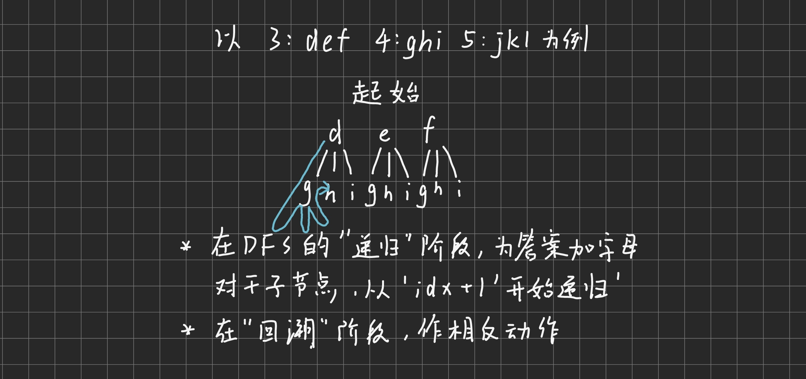

# 电话号码的数字组合

[17. 电话号码的数字组合](https://leetcode.cn/problems/letter-combinations-of-a-phone-number/description/)

## 题目大意
一个功能机有数字对应字母的功能，现在输入一段数字，求其所有的输出字母组合

## 方法一、DFS+回溯

### 思想
1. 题目类型属于**可重复的暴力搜索**
2. 对于每个数字，枚举其对应的字母并添加到输出中
3. 作为DFS的第一道题，本题的重点在于让我们了解**DFS的结构**


### 整体代码
```
class Solution {
public:
    unordered_map<char, string> hash{
        {'2',"abc"},
        {'3',"def"},
        {'4',"ghi"},
        {'5',"jkl"},
        {'6',"mno"},
        {'7',"pqrs"},
        {'8',"tuv"},
        {'9',"wxyz"}
    };

    vector<string> ans;
    string path;
    void dfs(string &digits, int idx){
        if(idx == digits.size()){
            ans.push_back(path);
            return;
        }
        for(auto d : hash[digits[idx]]){
            path.push_back(d);
            dfs(digits, idx+1);
            path.pop_back();
        }
        return;
    }

    vector<string> letterCombinations(string digits) {
        if(digits.empty()) return ans;
        dfs(digits, 0);
        return ans;
    }
};
```

### 细节分析
1. `unordered_map<char, string> hash`本题使用了愚蠢的哈希表存储对应字母，还可以使用
   `string MAP[10]`这种写法
2. DFS回溯体如下：
   ```
   void dfs(string &digits, int idx){
        if(idx == digits.size()){
            ans.push_back(path);
            return;
        }
        for(auto d : hash[digits[idx]]){
            path.push_back(d);
            dfs(digits, idx+1);
            path.pop_back();
        }
        return;
    }
   ```
   * 结束标志是`if(idx == digits.size())`,意为在递归结束后将结果加入答案队列
   * `for(auto d : hash[digits[idx]])`在递归树中的表现是寻找该节点的**所有子节点**
     ，在本题中的表现是遍历所有数字下的字母
   * `path.push_back(d);`是**子节点递归前置**，本题只有一个前置
   * `dfs(digits, idx+1);`是**子节点递归体**，相对于父节点`idx++`，意思是递归下一个
     数字
   * `path.pop_back();`是**子节点递归后置**，与前置的操作完全相反；在实际问题中，
     前置和后置最好**配对出现**
3. `dfs(digits, 0);`在`main`中，从`idx=0`开始递归

### 时空复杂度分析
* DFS的时间复杂度就是**遍历的节点数**，因此本题的时间复杂度是 $O(3^m \times 4^n)$，其中 $3^m$ 代表遍历字母数为3的数字， $4^n$ 是字母数为4的数字
* DFS的空间复杂度是递归调用的最大层数，本题的最大层数是 $m+n$ ,即所有数字的总数，因此空间复杂度为 $O(m+n)$ 
