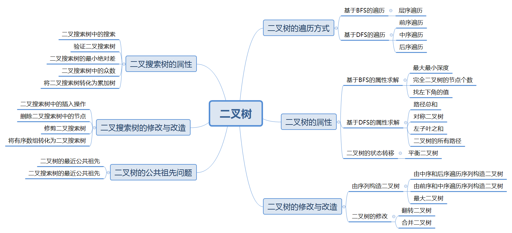

# 二叉树

## 二叉树的种类

### 1. 满二叉树
* 定义：二叉树**只有度为0和2**的节点，且度为0的节点在同一层
* 深度为 $k$ 的满二叉树有 $2^k-1$ 个节点

### 2. 完全二叉树
* 定义：除了最底层可能没被填满，其余层都被填满，且最底层的节点都在最左边
* 最底层节点个数为 $1 \sim 2^{k-1}$
* **堆是一个完全二叉树**

### 3. 二叉搜索树
* 二叉搜索树是一个有数值的**有序树**
* 若二叉搜索树的左/右子树不为空，则其左/右子树上的节点均小于/大于根节点
* 其左右子树也都是二叉搜索树

### 4. 平衡二叉搜索树（AVL树）
* 是一颗空树或其**左右子树高度差不大于1**
* 其左右子树都是平衡二叉搜索树
* C++中的`map`，`set`，`muiltmap`，`muiltset`的底层实现都是AVL树
