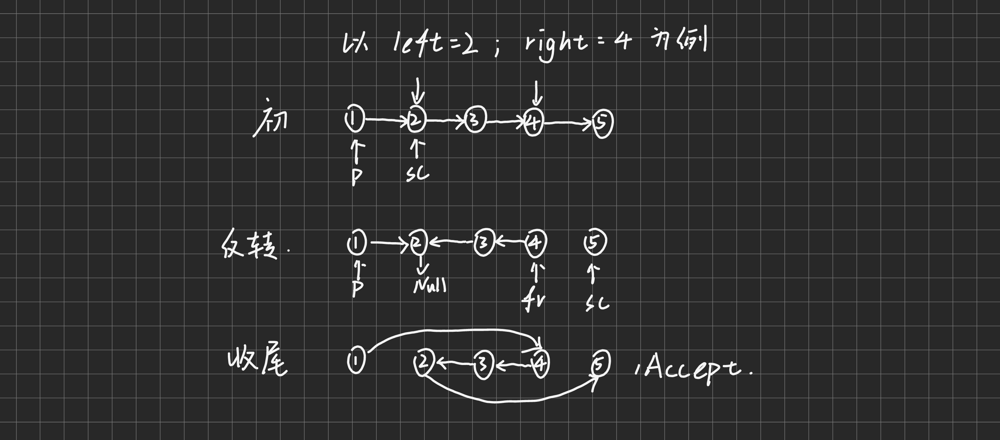

# 反转链表II

[92.反转链表II](https://leetcode.cn/problems/reverse-linked-list-ii/description/)

## 题目大意
题目给出`left`,`right`，要求反转两个指针之间的链表

### 题目要点
* 除了循环部分，要注意`left`的前一个指针和`right`的后一个指针

## 方法一、循环迭代

### 思路
1. 通过计数循环实现局部反转
2. 在局部反转的基础上，要记录**左边界的左**和**右边界的右**，方便在反转后插入  



### 整体代码
```
class Solution {
public:
    ListNode* reverseBetween(ListNode* head, int left, int right) {
        if(!head->next) return head;
        ListNode* dummy = new ListNode(0, head);
        ListNode* p = dummy;

        for(int i=0;i<left-1;i++) p = p->next;

        ListNode *first = nullptr, *second = p->next;
        for(int i=0;i<right-left+1;i++){ 
            ListNode* third = second->next;
            second->next = first;
            first = second;
            second = third;
        }

        p->next->next = second;
        p->next = first;

        return dummy->next;
    }
};
```

### 局部代码
1. 值得注意的是，在反转链表结束后返回的头节点是`first`，`second`指向的是下一个节点或者`nullptr`
2. 此外，在旋转链表时，`head`节点会被指向`nullptr`，而这也会被视为**一次反转**，数循环次数时不能漏了
3. `for(int i=0;i<left-1;i++) p = p->next;`,`p`是前驱节点

### 时空复杂度分析
* 反转了一部分链表，时间复杂度为 $O(n)$
* 开了几个指针，空间复杂度为 $O(1)$  

### 思考
1. 链表题给关键在于每个需要用到的节点都要有至少一个**指针指向**
2. 具体到本题，需要控制循环次数以**控制指针指向**
