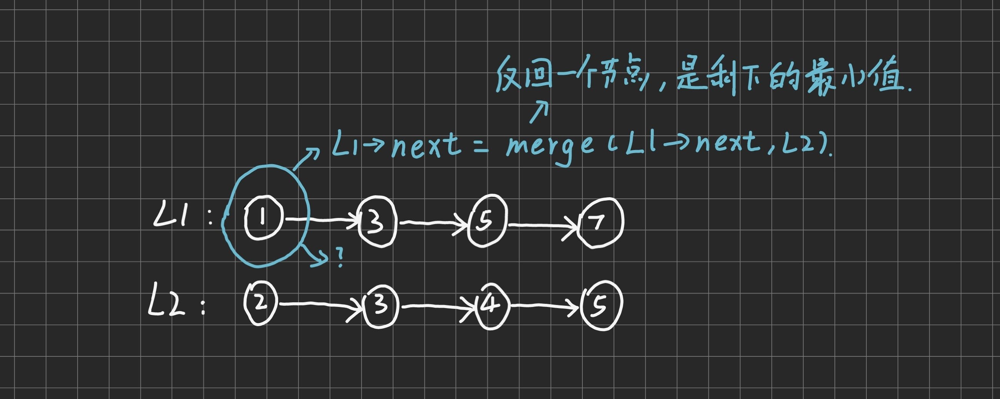

# 合并两个有序链表

> 不识庐山真面目，只缘身在此山中

[合并两个有序链表](https://leetcode.cn/problems/merge-two-sorted-lists/)

## 题目大意
将两个升序链表合并为一个新的升序链表

## 方法一、递归

### 思路
1. 如果有一个链表是空链表，则返回另一个
2. 如果`list1`的下一个数小于`list2`的下一个数，**递归调用**`list1`的下一个数
3. **递归就像一个接口，我们不需要知道上级和下级是干什么的，我们只需要知道下级返回什么，我们需要向上级返回什么**




### 整体代码
```
class Solution {
public:
    ListNode* mergeTwoLists(ListNode* list1, ListNode* list2) {
        if(!list1) return list2;
        else if(!list2) return list1;

        else if(list1->val>list2->val) {
            list2->next = mergeTwoLists(list1,list2->next);
            return list2;
        }
        else {
            list1->next = mergeTwoLists(list1->next,list2);
            return list1;
        }
    }
};
```

### 局部代码
1. 基判断`if(!list1) return list2; else if(!list2) return list1;`只有在两个链表中至少有一个为空时结束递归
2. `list2->next = mergeTwoLists(list1,list2->next);`先不考虑`list2->next`具体指向哪，而是找到所有没被递归的点；在下一次递归中会自动找到所有点中的最小值
3. 不要掉入递归，只要考虑到这一层就好
