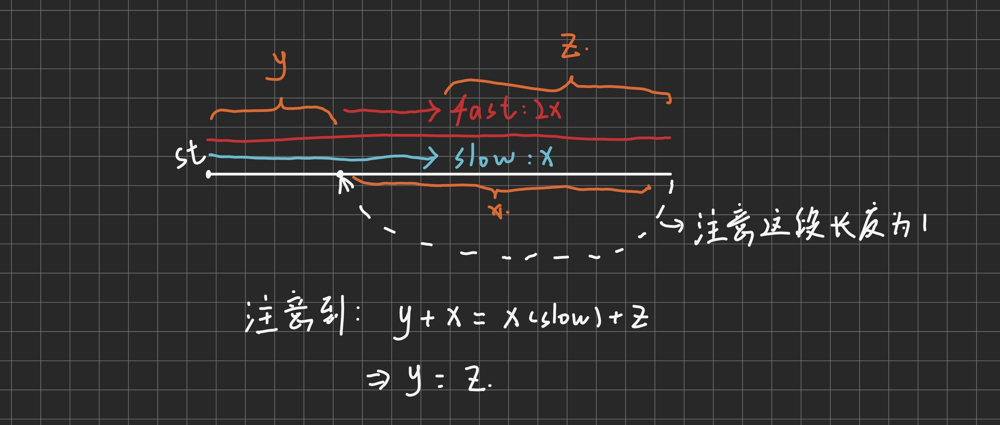

# 环形链表II

[环形链表II](https://leetcode.cn/problems/linked-list-cycle-ii/)

## 题目大意
要求判断一个链表是否成环，并返回成环的节点

## 方法一、三指针|快慢刀

### 思路



1. 由图可知：`fast`指针和`slow`指针第一次相遇时距离环结的距离就是`head`距离环节的距离
2. 只需要在快慢指针相遇时再开一个新指针与慢指针速度相同，当该指针与`slow`相遇时就是环节

### 整体代码
```
class Solution {
public:
    ListNode *detectCycle(ListNode *head) {
        if(!head) return NULL;
        if(!head->next) return NULL;
        ListNode* slow = head->next, *fast = slow->next, *find = head;

        bool flag = false;
        while(fast && fast->next && fast->next->next){
            if(fast == slow) flag = true;
            
            fast = fast->next->next;
            slow = slow->next;
            
            if(flag) find = find->next;
            if(slow == find) return find; 
        }
        return NULL;
    }
};
```

### 时空复杂度分析
* 只遍历了链表一次，时间复杂度为 $O(n)$
* 空间复杂度为 $O(1)$
